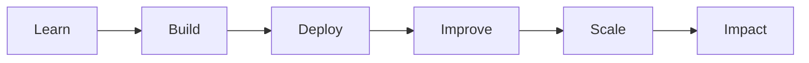

<div align="center">


<br>


</div>

---

# 👨‍💻 About Me

```ts
const praise = {
  role: "Full Stack Web Developer",

  location: "Nigeria 🇳🇬",

  languages: [
    "TypeScript",
    "JavaScript"
  ],

  frontend: [
    "React",
    "Next.js",
    "Tailwind CSS"
  ],

  backend: [
    "Node.js",
    "Express",
    "Supabase"
  ],

  database: [
    "PostgreSQL",
    "MongoDB"
  ],

  tools: [
    "Git",
    "GitHub",
    "Docker",
    "Figma",
    "VS Code"
  ],

  currentlyLearning: [
    "Cloud",
    "Kubernetes",
    "AI"
  ],

  goal:
    "Build scalable products that solve real-world problems."
}
```

---

# ⚒️ Tech Stack

<div align="center">


</div>

---

# 📊 GitHub Analytics

<div align="center">


</div>

<br>

<div align="center">


</div>

---

# 📈 Contribution Graph

<div align="center">


</div>

---


# 📊 GitHub Metrics

<div align="center">


</div>


# 🐍 Contribution Snake

<div align="center">


</div>
# 🚀 Current Focus

<div align="center">

| Learning | Building | Improving |
|-----------|-----------|-----------|
| ☁️ Cloud Computing | 🌐 Modern Web Apps | 🎨 UI/UX Design |
| ⚙️ Kubernetes | ⚡ Full Stack Projects | 🧠 Problem Solving |
| 🤖 AI Integration | 🚀 Scalable Systems | 💻 Clean Code |

</div>

---

# 💡 Developer Mindset

```txt
Code.
Break.
Debug.
Learn.
Improve.
Repeat.
```

---

# 🎯 2026 Goals

- ✅ Master Next.js
- ✅ Build production-ready full stack applications
- ✅ Learn Kubernetes and Cloud deployment
- ✅ Contribute to Open Source
- ✅ Create impactful products
- 🚀 Become a world-class software engineer

---

# ⚡ Fun Facts

- 🌙 Most productive at night
- 💻 Love building things from scratch
- 🎨 Enjoy creating beautiful user interfaces
- 📚 Always learning new technologies
- 🚀 Passionate about software engineering

---

# 🌟 What I'm Working Toward



---

# 🔥 Contribution Activity

<div align="center">


</div>

---

# 📅 Coding Journey

```txt
2024 ───────── Started Full Stack Development

      ↓

Learning React & Next.js

      ↓

Building Real Projects

      ↓

Exploring AI & Cloud

      ↓

Future Software Engineer 🚀
```

---

# 🛠 Development Environment

```yaml
OS: Windows / Android

Editor: VS Code

Terminal: PowerShell

Version Control: Git + GitHub

Frontend:
  - React
  - Next.js
  - TypeScript
  - Tailwind CSS

Backend:
  - Node.js
  - Express
  - Supabase

Database:
  - PostgreSQL
  - MongoDB
```

---

# 📚 Favorite Technologies

<div align="center">


</div>

---

# 🎵 Currently Vibing To

```txt
Focus.
Consistency.
Growth.
```

---

# 🌐 Connect With Me

<div align="center">

<a href="https://github.com/Praise1-byte">

</a>

<a href="mailto: adeyemipraise2708@gmail.com">

</a>

<a href="https://www.linkedin.com/in/YOUR_LINKEDIN">

</a>

<a href="https://x.com/YOUR_USERNAME">

</a>

</div>

---

# 💬 Quote

<div align="center">

> **"Great software isn't built in a day—it's built every day."**

</div>

---

#
---

# ☕ Support My Work

<div align="center">

If you enjoy my projects, consider ⭐ starring the repositories you like.

</div>

---

# 👀 Visitor Counter

<div align="center">


</div>

---

<div align="center">

### 💙 Thanks for Visiting


</div>
